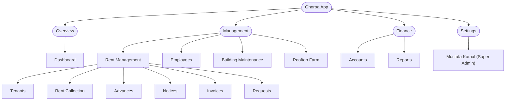

## Dashboard Sidebar Structure

**Diagram**

```mermaid
graph TD
    A([Ghoroa App]) --> B([Overview])
    A --> C([Management])
    A --> D([Finance])
    A --> E([Settings])

    B --> B1[Dashboard]

    C --> C1[Rent Management]
    C --> C2[Employees]
    C --> C3[Building Maintenance]
    C --> C4[Rooftop Farm]

    C1 --> C1a[Tenants]
    C1 --> C1b[Rent Collection]
    C1 --> C1c[Advances]
    C1 --> C1d[Notices]
    C1 --> C1e[Invoices]
    C1 --> C1f[Requests]

    D --> D1[Accounts]
    D --> D2[Reports]

    E --> E1["Mustafa Kamal (Super Admin)"]
```
