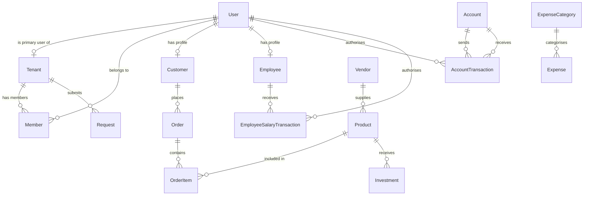
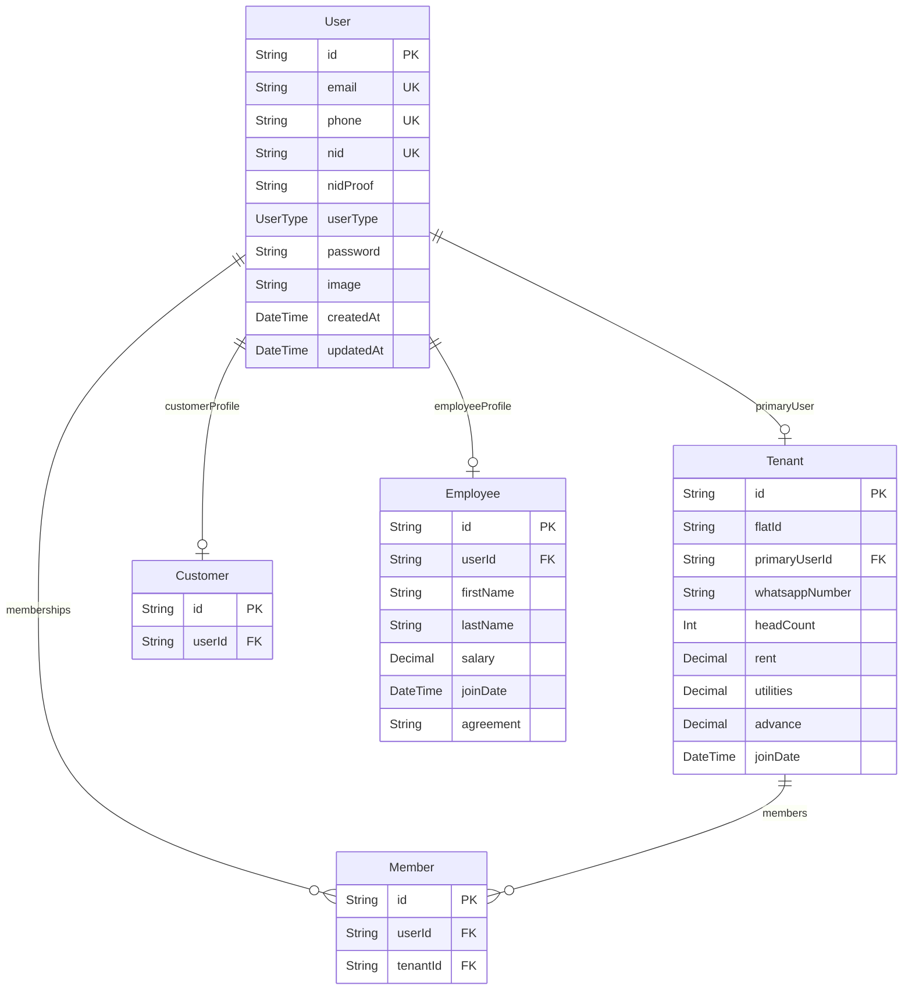
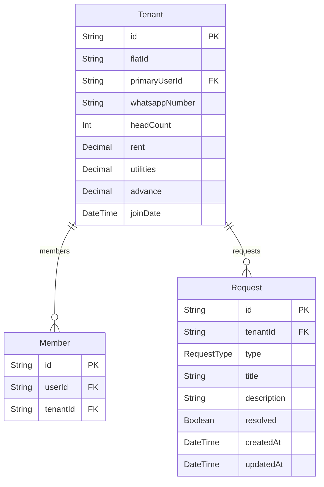
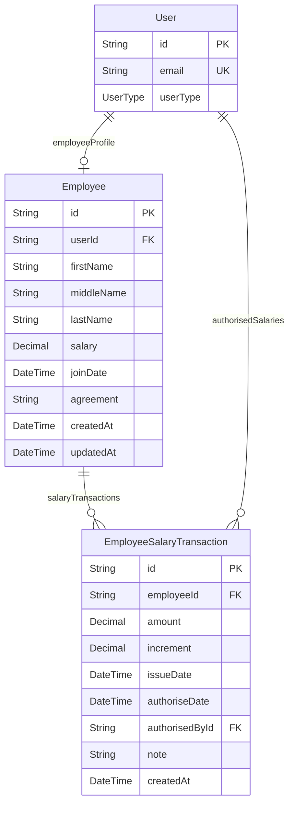
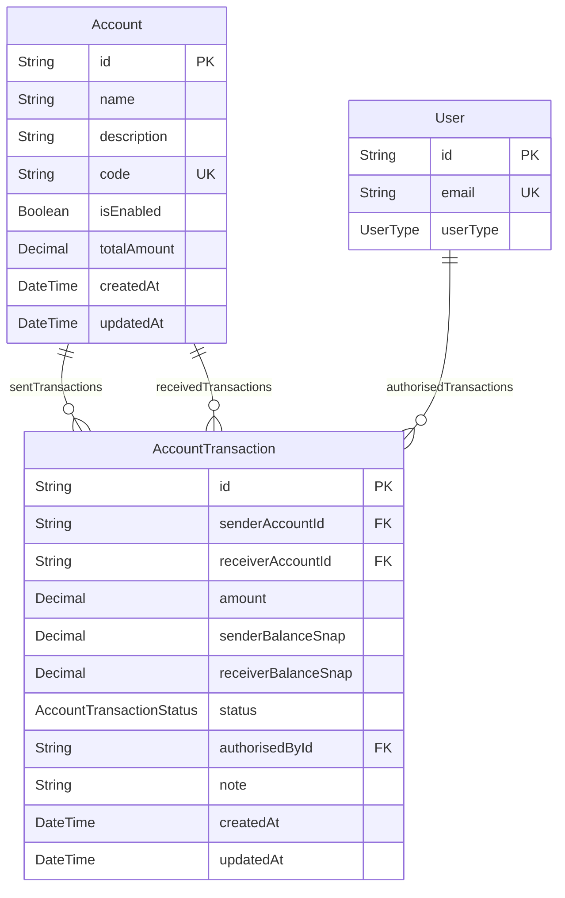
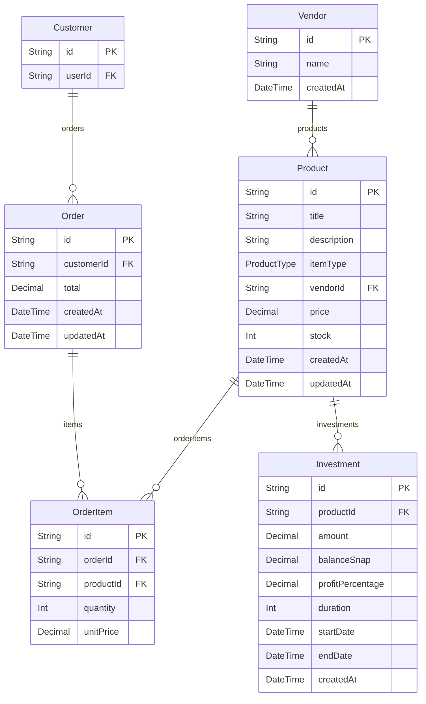
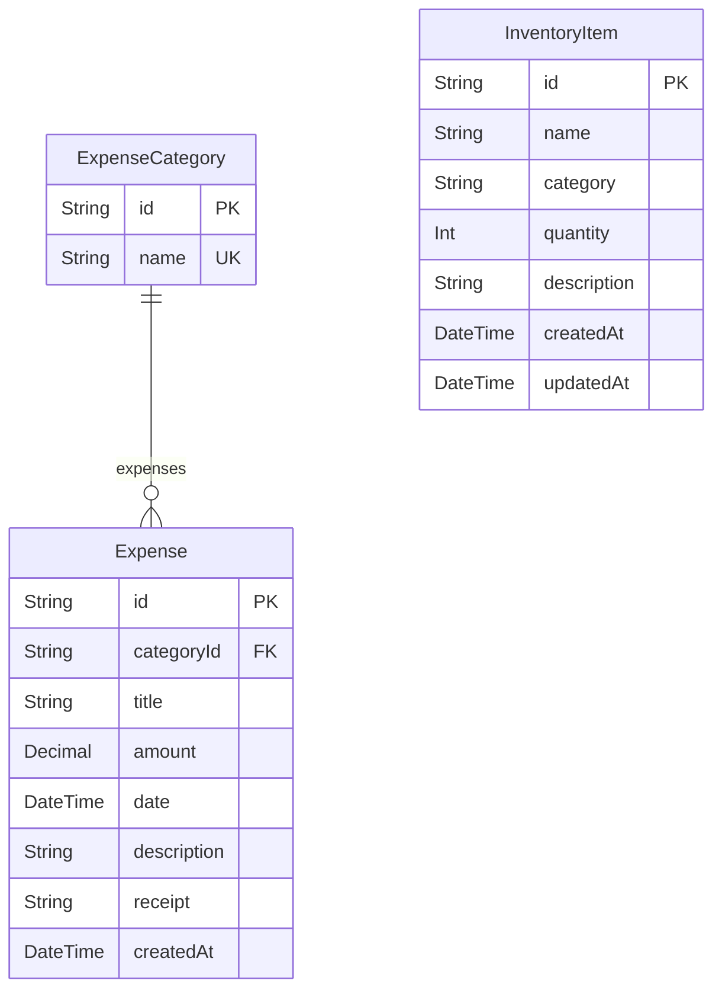

# 🏠 Ghoroa — Project Overview

> A full-stack property management platform built with Nuxt.js, enabling building owners and landlords to digitize rent collection, track expenses, manage employees, run a rooftop farm business, and generate financial reports — all from one place.

---

## Table of Contents

- [Problem Statement](#problem-statement)
- [Users & Roles](#users--roles)
- [Modules & Features](#modules--features)
- [Data Models (Prisma)](#data-models-prisma)
- [Tech Stack](#tech-stack)
- [UI/UX System](#uiux-system)
- [Sidebar Navigation Map](#sidebar-navigation-map)
- [Project File Structure](#project-file-structure)

---

## Problem Statement

Building owners and landlords currently manage their properties with paper records, leading to:

| Pain Point                         | Impact                           |
| ---------------------------------- | -------------------------------- |
| Rent stored on paper               | No audit trail, easy to lose     |
| Rent income spent without tracking | No accountability                |
| Building expenses uncategorized    | Cannot see where money goes      |
| No employee salary records         | Disputes, no history             |
| No rooftop farm management         | Lost production & revenue        |
| No financial analytics             | Cannot make investment decisions |
| No tenant communication system     | Slow notice delivery             |

**Goal:** Replace paper with a digital system that tracks income, expenses, and production — and surfaces insights so rent income can be reinvested intelligently into on-property businesses (rooftop farming, etc.).

---

## Users & Roles

| Role        | Icon | Access Level                                                               |
| ----------- | ---- | -------------------------------------------------------------------------- |
| Super Admin | 👑   | Full access — authorise invoices, rents, notices, manage admins, CC camera |
| Admin       | 🛠️   | Create rent/income records, expenses, bills, invoices                      |
| Tenant      | 🏠   | View own rent history, submit requests/complaints                          |
| Customer    | 🛒   | Browse and order rooftop farm products                                     |
| Employee    | 👤   | View own salary slips, assigned work                                       |

---

## Modules & Features

### A. 🏘️ Rent Management

| Feature                 | Notes                                           |
| ----------------------- | ----------------------------------------------- |
| Rent accounts           | Track per-flat rent accounts                    |
| Monthly rent collection | Log payments per tenant per month               |
| Advance payments        | Record and deduct from future dues              |
| Tenant profiles         | NID, agreement, clauses, rent history, photo    |
| Notices                 | Create and send to tenants (+ WhatsApp)         |
| File/image/link storage | Attach documents to tenant records              |
| Requests                | Tenants submit complaints, reviews, suggestions |
| Reports                 | Export rent summary as PDF / XLSX               |
| Invoices                | Generate rent invoices per tenant               |

> All item types are either **system-locked** (cannot be renamed/deleted) or **user-created custom types**.

**System Item Types (locked):**
`rent_account` · `monthly_rent` · `advance` · `tenant_profile` · `notice` · `file` · `image` · `link` · `request` · `report` · `invoice`

---

### B. 👥 Employee Management

| Feature           | Notes                                          |
| ----------------- | ---------------------------------------------- |
| Employee profiles | Personal info, NID, photo, agreement, clauses  |
| Salary management | Base salary + increments + transaction history |
| Work distribution | Assign tasks/work orders to employees          |
| Benefits          | Track additional employee benefits             |

---

### C. 🔧 Building Maintenance

| Feature            | Notes                                                        |
| ------------------ | ------------------------------------------------------------ |
| Expense tracking   | Log all maintenance spend                                    |
| Expense categories | Painting, plumbing, electrical, hardware, etc.               |
| Inventory          | Track keys, gas cards, electricity cards, building resources |
| Security equipment | Log cameras, locks, intercoms                                |

---

### D. 🌿 Rooftop Farming

| Feature                 | Notes                                          |
| ----------------------- | ---------------------------------------------- |
| Investment              | Invest from rent/income accounts into the farm |
| Inventory & production  | Track yields, stock levels                     |
| Buy & sell / e-commerce | Manage products, orders, suppliers             |
| Analytics               | Profit/loss, yield trends                      |
| Delivery                | Manage delivery of orders                      |
| Invoices                | Customer and supplier invoices                 |

**Product Types:**
`vegetable` · `fruit` · `meat (chicken)` · `meat (koyel)` · `egg (chicken)` · `egg (koyel)`

---

### E. ⚙️ Platform Features

| Feature                 | Notes                                  |
| ----------------------- | -------------------------------------- |
| 💬 WhatsApp Integration | Send group notices directly to tenants |
| 📊 Analytics Dashboard  | Income vs expense across all modules   |
| 📄 Monthly Reports      | Finance summary, work log, todos       |
| 📹 CC Camera Access     | Super Admin only                       |
| 📤 Export               | PDF, XLSX for any data table           |
| 🌙 Dark Mode            | Optional, toggled in settings          |
| 💬 Quote Generator      | Generate quotes for work/products      |
| 📁 File Uploads         | Stored in Cloudflare R2                |

---

### F. 🔐 Authentication

- Email / phone number / username + password
- Gmail OAuth (Google Sign-In)
- Powered by **Nuxt Auth v5**

---

## Data Models (Prisma)

> **IMPORTANT:** Never use `prisma db push`. Always create migration files and run them via `prisma migrate dev` (dev) and `prisma migrate deploy` (prod).

```prisma
// schema.prisma

generator client {
  provider = "prisma-client-js"
}

datasource db {
  provider = "postgresql"
  url      = env("DATABASE_URL")
}

// ─────────────────────────────────────────
// ENUMS
// ─────────────────────────────────────────

enum UserType {
  SUPER_ADMIN
  ADMIN
  TENANT
  CUSTOMER
  EMPLOYEE
}

enum AccountTransactionStatus {
  DRAFT
  AUTHORISED
  COMPLETE
}

enum ProductType {
  VEGETABLE
  FRUIT
  MEAT_CHICKEN
  MEAT_KOYEL
  EGG_CHICKEN
  EGG_KOYEL
}

enum RequestType {
  COMPLAINT
  REVIEW
  SUGGESTION
}

// ─────────────────────────────────────────
// USER
// ─────────────────────────────────────────

model User {
  id          String   @id @default(uuid())
  email       String?  @unique
  phone       String?  @unique
  nid         String?  @unique
  nidProof    String?  // R2 file URL
  userType    UserType @default(TENANT)
  password    String?
  image       String?
  createdAt   DateTime @default(now())
  updatedAt   DateTime @updatedAt

  // Relations
  tenantPrimary           Tenant?                  @relation("PrimaryUser")
  memberships             Member[]
  customerProfile         Customer?
  employeeProfile         Employee?
  authorisedTransactions  AccountTransaction[]     @relation("AuthorisedBy")
  authorisedSalaries      EmployeeSalaryTransaction[] @relation("AuthorisedBy")

  @@map("users")
}

// ─────────────────────────────────────────
// TENANT
// ─────────────────────────────────────────

model Tenant {
  id              String   @id @default(uuid())
  flatId          String
  primaryUserId   String   @unique
  primaryUser     User     @relation("PrimaryUser", fields: [primaryUserId], references: [id])
  whatsappNumber  String?
  headCount       Int      @default(1)
  rent            Decimal  @db.Decimal(10, 2)
  utilities       Decimal? @db.Decimal(10, 2)
  advance         Decimal? @db.Decimal(10, 2)
  joinDate        DateTime
  createdAt       DateTime @default(now())
  updatedAt       DateTime @updatedAt

  members         Member[]
  requests        Request[]

  @@map("tenants")
}

model Member {
  id        String  @id @default(uuid())
  userId    String
  tenantId  String
  user      User    @relation(fields: [userId], references: [id])
  tenant    Tenant  @relation(fields: [tenantId], references: [id])

  @@unique([userId, tenantId])
  @@map("members")
}

// ─────────────────────────────────────────
// CUSTOMER
// ─────────────────────────────────────────

model Customer {
  id        String  @id @default(uuid())
  userId    String  @unique
  user      User    @relation(fields: [userId], references: [id])
  orders    Order[]

  @@map("customers")
}

// ─────────────────────────────────────────
// EMPLOYEE
// ─────────────────────────────────────────

model Employee {
  id          String   @id @default(uuid())
  userId      String   @unique
  user        User     @relation(fields: [userId], references: [id])
  firstName   String
  middleName  String?
  lastName    String
  salary      Decimal  @db.Decimal(10, 2)
  joinDate    DateTime
  agreement   String?  // R2 file URL
  createdAt   DateTime @default(now())
  updatedAt   DateTime @updatedAt

  salaryTransactions EmployeeSalaryTransaction[]

  @@map("employees")
}

model EmployeeSalaryTransaction {
  id              String    @id @default(uuid())
  employeeId      String
  employee        Employee  @relation(fields: [employeeId], references: [id])
  amount          Decimal   @db.Decimal(10, 2)
  increment       Decimal?  @db.Decimal(10, 2)
  issueDate       DateTime
  authoriseDate   DateTime?
  authorisedById  String?
  authorisedBy    User?     @relation("AuthorisedBy", fields: [authorisedById], references: [id])
  note            String?
  createdAt       DateTime  @default(now())

  @@map("employee_salary_transactions")
}

// ─────────────────────────────────────────
// ACCOUNTS
// ─────────────────────────────────────────

model Account {
  id           String   @id @default(uuid())
  name         String
  description  String?
  code         String   @unique
  isEnabled    Boolean  @default(true)
  totalAmount  Decimal  @default(0) @db.Decimal(12, 2)
  createdAt    DateTime @default(now())
  updatedAt    DateTime @updatedAt

  sentTransactions     AccountTransaction[] @relation("SenderAccount")
  receivedTransactions AccountTransaction[] @relation("ReceiverAccount")

  @@map("accounts")
}

model AccountTransaction {
  id                    String                   @id @default(uuid())
  senderAccountId       String
  receiverAccountId     String
  senderAccount         Account                  @relation("SenderAccount", fields: [senderAccountId], references: [id])
  receiverAccount       Account                  @relation("ReceiverAccount", fields: [receiverAccountId], references: [id])
  amount                Decimal                  @db.Decimal(12, 2)
  senderBalanceSnap     Decimal                  @db.Decimal(12, 2)
  receiverBalanceSnap   Decimal                  @db.Decimal(12, 2)
  status                AccountTransactionStatus @default(DRAFT)
  authorisedById        String?
  authorisedBy          User?                    @relation("AuthorisedBy", fields: [authorisedById], references: [id])
  note                  String?
  createdAt             DateTime                 @default(now())
  updatedAt             DateTime                 @updatedAt

  @@map("account_transactions")
}

// ─────────────────────────────────────────
// PRODUCTS & ORDERS (Rooftop Farm)
// ─────────────────────────────────────────

model Vendor {
  id        String    @id @default(uuid())
  name      String
  products  Product[]
  createdAt DateTime  @default(now())

  @@map("vendors")
}

model Product {
  id          String      @id @default(uuid())
  title       String
  description String?
  itemType    ProductType
  vendorId    String?
  vendor      Vendor?     @relation(fields: [vendorId], references: [id])
  price       Decimal?    @db.Decimal(10, 2)
  stock       Int         @default(0)
  createdAt   DateTime    @default(now())
  updatedAt   DateTime    @updatedAt

  orderItems  OrderItem[]
  investments Investment[]

  @@map("products")
}

model Order {
  id          String      @id @default(uuid())
  customerId  String
  customer    Customer    @relation(fields: [customerId], references: [id])
  total       Decimal     @db.Decimal(10, 2)
  createdAt   DateTime    @default(now())
  updatedAt   DateTime    @updatedAt

  items       OrderItem[]

  @@map("orders")
}

model OrderItem {
  id        String  @id @default(uuid())
  orderId   String
  productId String
  order     Order   @relation(fields: [orderId], references: [id])
  product   Product @relation(fields: [productId], references: [id])
  quantity  Int
  unitPrice Decimal @db.Decimal(10, 2)

  @@map("order_items")
}

// ─────────────────────────────────────────
// INVESTMENTS
// ─────────────────────────────────────────

model Investment {
  id               String   @id @default(uuid())
  productId        String
  product          Product  @relation(fields: [productId], references: [id])
  amount           Decimal  @db.Decimal(12, 2)
  balanceSnap      Decimal  @db.Decimal(12, 2)
  profitPercentage Decimal? @db.Decimal(5, 2)
  duration         Int?     // in days
  startDate        DateTime
  endDate          DateTime?
  createdAt        DateTime @default(now())

  @@map("investments")
}

// ─────────────────────────────────────────
// REQUESTS (Tenant complaints, reviews, etc.)
// ─────────────────────────────────────────

model Request {
  id          String      @id @default(uuid())
  tenantId    String
  tenant      Tenant      @relation(fields: [tenantId], references: [id])
  type        RequestType
  title       String
  description String?
  resolved    Boolean     @default(false)
  createdAt   DateTime    @default(now())
  updatedAt   DateTime    @updatedAt

  @@map("requests")
}

// ─────────────────────────────────────────
// MAINTENANCE EXPENSES
// ─────────────────────────────────────────

model ExpenseCategory {
  id        String    @id @default(uuid())
  name      String    @unique
  expenses  Expense[]

  @@map("expense_categories")
}

model Expense {
  id          String          @id @default(uuid())
  categoryId  String
  category    ExpenseCategory @relation(fields: [categoryId], references: [id])
  title       String
  amount      Decimal         @db.Decimal(10, 2)
  date        DateTime
  description String?
  receipt     String?         // R2 file URL
  createdAt   DateTime        @default(now())

  @@map("expenses")
}

// ─────────────────────────────────────────
// INVENTORY
// ─────────────────────────────────────────

model InventoryItem {
  id          String   @id @default(uuid())
  name        String
  category    String   // keys, gas cards, electricity cards, etc.
  quantity    Int      @default(0)
  description String?
  createdAt   DateTime @default(now())
  updatedAt   DateTime @updatedAt

  @@map("inventory_items")
}
```

---

## Tech Stack

| Layer                 | Technology                                                               |
| --------------------- | ------------------------------------------------------------------------ |
| **Framework**         | [Nuxt.js](https://nuxt.com) — SSR with dynamic components                |
| **State Management**  | [Pinia](https://pinia.vuejs.org/)                                        |
| **Language**          | JavaScript                                                               |
| **Database**          | [Neon](https://neon.tech) — Serverless PostgreSQL                        |
| **ORM**               | [Prisma 7](https://www.prisma.io/docs) — migrations only, no `db push`   |
| **Caching**           | Redis _(optional, evaluate later)_                                       |
| **File Storage**      | [Cloudflare R2](https://developers.cloudflare.com/r2/)                   |
| **Auth**              | [Nuxt Auth v5](https://auth.sidebase.io/) — email/password + Gmail OAuth |
| **Component Library** | [Ant Design Vue](https://antdv.com/)                                     |
| **CSS**               | [Tailwind CSS](https://tailwindcss.com/)                                 |
| **API**               | Nuxt API routes (server/api/)                                            |

> **Migration rule:** Always generate and review migration files. Run `prisma migrate dev` in development and `prisma migrate deploy` in production. Never run `prisma db push`.

---

## UI/UX System

### Design Principles

- Modern, minimal, information-dense — readable by senior citizens
- Light mode by default; dark mode togglable
- Clean typography (DM Sans), generous whitespace
- Subtle borders and shadows
- Design references: [Notion](https://notion.so), [Linear](https://linear.app), [Raycast](https://raycast.com)

### Layout

```
┌─────────────┬──────────────────────────────────────┐
│             │  Header (breadcrumb, actions, user)  │
│   Sidebar   ├──────────────────────────────────────┤
│  (modules   │                                      │
│   & links)  │   Main Content Area                  │
│             │   (tables / forms / analytics)       │
│  Collapses  │                                      │
│  on mobile  │                        ┌───────────┐ │
│             │                        │  Drawer   │ │
└─────────────┴────────────────────────┴───────────┘
```

- Sidebar collapses into a drawer on mobile
- Quick-create items open in a **side drawer** (not a new page)
- Toast notifications for all actions
- Loading skeletons on data fetch

### Theme Tokens

```js
// app.vue — Ant Design Vue Config Provider

import { theme } from "ant-design-vue";

const darkTheme = {
  algorithm: theme.darkAlgorithm,
  token: {
    colorPrimary: "#3ecf8e",
    colorInfo: "#22d3ee",
    colorSuccess: "#4ade80",
    colorWarning: "#f97316",
    colorError: "#ef4444",
    colorBgBase: "#0d0f14",
    colorBgContainer: "#13161e",
    colorBgElevated: "#1a1e2a",
    colorTextBase: "#e8eaf0",
    colorTextSecondary: "#8a8fa8",
    colorBorder: "rgba(255,255,255,0.08)",
    borderRadius: 12,
    fontFamily: "'DM Sans', sans-serif",
  },
};

const lightTheme = {
  algorithm: theme.defaultAlgorithm,
  token: {
    colorPrimary: "#16a34a",
    colorInfo: "#0891b2",
    colorSuccess: "#16a34a",
    colorWarning: "#ea580c",
    colorError: "#ef4444",
    colorBgBase: "#f4f6fb",
    colorBgContainer: "#ffffff",
    colorBgElevated: "#eef1f8",
    colorTextBase: "#1a1d2e",
    colorTextSecondary: "#5a6075",
    colorBorder: "rgba(0,0,0,0.08)",
    borderRadius: 12,
    fontFamily: "'DM Sans', sans-serif",
  },
};
```

### Gradient Utilities

```css
/* Gradient button — add class to <a-button> */
.custom-gradient-btn {
  background: linear-gradient(135deg, #3ecf8e, #22d3ee) !important;
  color: #fff !important;
  border: none !important;
  box-shadow: 0 4px 20px rgba(62, 207, 142, 0.3) !important;
  transition: all 0.2s ease;
}
.custom-gradient-btn:hover {
  transform: translateY(-2px);
  box-shadow: 0 8px 28px rgba(62, 207, 142, 0.45) !important;
}
[data-theme="light"] .custom-gradient-btn {
  background: linear-gradient(135deg, #16a34a, #0891b2) !important;
}

/* Gradient text — add class to <span> inside <a-typography-title> */
.gradient-text {
  background: linear-gradient(135deg, #3ecf8e 0%, #22d3ee 100%);
  -webkit-background-clip: text;
  -webkit-text-fill-color: transparent;
  background-clip: text;
}
[data-theme="light"] .gradient-text {
  background: linear-gradient(135deg, #16a34a 0%, #0891b2 100%);
}
```

---

## Sidebar Navigation Map

```
🏠  Ghoroa
│
├── 📊  Dashboard
│     └── Overview, income/expense summary, quick stats
│
├── 🏘️  Rent Management
│     ├── Tenants
│     ├── Rent Collection
│     ├── Advances
│     ├── Notices
│     ├── Invoices
│     └── Requests
│
├── 👥  Employees
│     ├── Employee List
│     ├── Salary Transactions
│     └── Work Distribution
│
├── 🔧  Building Maintenance
│     ├── Expenses
│     ├── Expense Categories
│     └── Inventory
│
├── 🌿  Rooftop Farm
│     ├── Products
│     ├── Orders
│     ├── Inventory & Production
│     ├── Investments
│     └── Analytics
│
├── 💰  Accounts
│     ├── Account List
│     └── Transactions
│
├── 📊  Reports
│     ├── Monthly Finance Report
│     ├── Rent Patterns
│     └── Income vs Expense
│
└── ⚙️  Settings
      ├── User Management
      ├── Roles & Permissions
      └── WhatsApp Integration
```

---

## Project File Structure

```
ghoroa/
├── assets/
│   └── css/
│       └── main.css          # Tailwind base + gradient utilities
├── components/
│   ├── layout/
│   │   ├── AppSidebar.vue
│   │   ├── AppHeader.vue
│   │   └── AppDrawer.vue     # Quick-create/view drawer
│   ├── rent/
│   ├── employee/
│   ├── farm/
│   └── shared/
│       ├── DataTable.vue
│       ├── StatCard.vue
│       └── FileUpload.vue
├── composables/
│   ├── useAuth.js
│   ├── useToast.js
│   └── useExport.js
├── pages/
│   ├── index.vue             # Dashboard
│   ├── rent/
│   │   ├── index.vue
│   │   └── [id].vue
│   ├── employees/
│   ├── maintenance/
│   ├── farm/
│   ├── accounts/
│   └── reports/
├── server/
│   ├── api/
│   │   ├── rent/
│   │   ├── employees/
│   │   ├── farm/
│   │   ├── accounts/
│   │   └── upload.js
│   └── middleware/
│       └── auth.js
├── stores/
│   ├── auth.js
│   ├── tenant.js
│   ├── employee.js
│   └── farm.js
├── layouts/
│   ├── default.vue           # Authenticated app shell — sidebar + header + main slot
│   ├── auth.vue              # Minimal centered layout for login/register pages
│   └── guest.vue             # Public-facing layout for customer shop/order pages
├── prisma/
│   ├── schema.prisma
│   └── migrations/
├── nuxt.config.js
└── .env
```

---

## Environment Variables

```env
# Database
DATABASE_URL=postgresql://...

# Auth
NUXT_AUTH_SECRET=
GOOGLE_CLIENT_ID=
GOOGLE_CLIENT_SECRET=

# Cloudflare R2
R2_ACCOUNT_ID=
R2_ACCESS_KEY_ID=
R2_SECRET_ACCESS_KEY=
R2_BUCKET_NAME=

# WhatsApp
WHATSAPP_API_KEY=
WHATSAPP_GROUP_ID=
```

---

## Development Notes

- Use `prisma migrate dev --name <migration_name>` for all schema changes
- Never run `prisma db push` in any environment
- All file uploads go through the `/api/upload` route to Cloudflare R2
- WhatsApp notices trigger from the Notices module; use a dedicated API route to keep credentials server-side
- CC camera access is restricted at the route middleware level to `SUPER_ADMIN` only
- Drawer state is managed globally via a Pinia store so any component can open it

---

## Data Model Diagrams

> Relational diagrams for all Prisma models, grouped by domain. Cardinality notation: `||` = one, `o{` = zero-or-many, `||--||` = one-to-one.

---

### Overview — Cross-Domain Relationships



---

### Domain 1 — User & Identity



---

### Domain 2 — Rent & Tenant



---

### Domain 3 — Employee & Salary



---

### Domain 4 — Accounts & Transactions



---

### Domain 5 — Rooftop Farm (Products, Orders & Investments)



---

### Domain 6 — Building Maintenance


